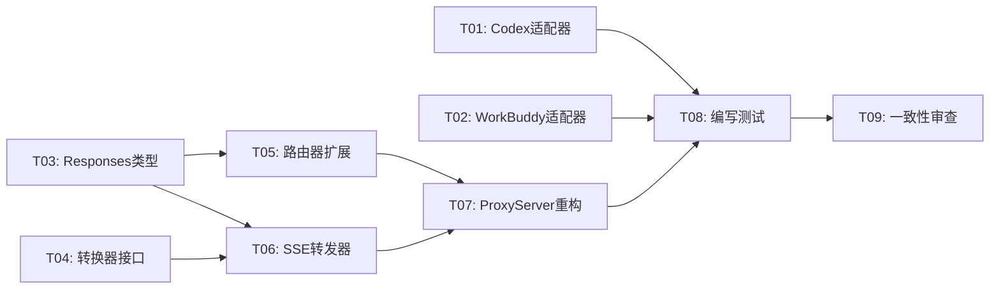

# Codex-Switch v1.1 架构设计文档

> 版本：v1.1 | 架构师：Gao | 日期：2026-06-03

---

## 1. 实现方案与框架选型

### 1.1 核心设计决策

| # | 决策 | 方案 | 理由 |
|---|------|------|------|
| D1 | **SSE 流式转发** | 请求体 `stream: true` 时走流式路径，否则走缓冲路径 | 向后兼容，最小变更 |
| D2 | **流式 chunk 转换** | MVP 阶段 OpenAI 兼容格式直通，不做 chunk 级转换 | 降低复杂度，覆盖 80% 场景 |
| D3 | **Codex config.toml 写入** | 读取现有 TOML → 修改特定字段 → 整体写回 | 保留用户现有配置段 |
| D4 | **WorkBuddy 多模型管理** | 读取/更新数组中匹配 id 的第一个元素 | 简化实现，单模型切换 |
| D5 | **Responses API 路由** | router 新增 `/v1/responses` 路径映射 | Codex CLI wire_api=responses |
| D6 | **流式转发器** | 新增 `SSEForwarder` 类，封装 SSE chunk 转发逻辑 | 职责分离，可测试 |

### 1.2 流式转发架构

```
客户端请求 (stream: true)
       │
       ▼
  ProxyServer.handleRequest()
       │
       ├── stream: false → 缓冲路径（现有逻辑）
       │
       └── stream: true  → 流式路径
              │
              ▼
         SSEForwarder.forward()
              │
              ├── 1. 转换请求体（convertRequest）
              ├── 2. 设置 SSE 响应头
              ├── 3. 发起上游 HTTP 请求
              ├── 4. 逐 chunk 转发到客户端
              └── 5. 结束时记录日志
```

### 1.3 代理请求分流逻辑

```typescript
// server.ts handleRequest() 修改
handleRequest(req, res) {
  // ...收集请求体...
  req.on('end', () => {
    const body = JSON.parse(bodyRaw)
    const isStreaming = body.stream === true

    if (isStreaming) {
      // 流式路径
      this.sseForwarder.forward(req, res, channel, body, converter)
    } else {
      // 缓冲路径（现有逻辑）
      this.forwardBuffered(req, res, channel, body, converter)
    }
  })
}
```

---

## 2. 文件列表及相对路径

### 修改文件

| 文件路径 | 变更类型 | 说明 |
|----------|----------|------|
| `src/main/client-adapter/codex.ts` | 🔴 重写 | 修正字段映射 + 保留写入 |
| `src/main/client-adapter/workbuddy.ts` | 🔴 重写 | 路径修正 + models.json 格式 |
| `src/main/proxy/server.ts` | 🟡 重构 | 新增流式路径分支 |
| `src/main/proxy/router.ts` | 🟡 修改 | 新增 Responses API 路由 |
| `src/main/converter/base.ts` | 🟡 修改 | 新增 supportsStreaming 标记 |
| `src/shared/types/proxy.ts` | 🟡 修改 | 新增 Responses API 类型 |

### 新增文件

| 文件路径 | 说明 |
|----------|------|
| `src/main/proxy/sse-forwarder.ts` | SSE 流式转发器 |
| `src/main/__tests__/codex-adapter.test.ts` | Codex 适配器测试 |
| `src/main/__tests__/workbuddy-adapter.test.ts` | WorkBuddy 适配器测试 |
| `src/main/__tests__/sse-forwarder.test.ts` | SSE 转发器测试 |
| `src/main/__tests__/proxy-router-responses.test.ts` | Responses API 路由测试 |

---

## 3. 数据结构和接口

### 3.1 新增类型（proxy.ts）

```typescript
/** Responses API 请求格式 */
export interface OpenAIResponsesRequest {
  model: string
  input: string | ResponseInputItem[]
  instructions?: string
  stream?: boolean
  temperature?: number
  max_output_tokens?: number
  [key: string]: unknown
}

/** Responses API 输入项 */
export interface ResponseInputItem {
  role: 'user' | 'assistant' | 'system'
  content: string | ContentPart[]
}

/** Responses API 内容部分 */
export interface ContentPart {
  type: 'input_text' | 'output_text'
  text: string
}

/** Responses API SSE 事件类型 */
export type ResponseEventType =
  | 'response.created'
  | 'response.in_progress'
  | 'response.output_item.added'
  | 'response.output_item.done'
  | 'response.content_part.added'
  | 'response.content_part.done'
  | 'response.output_text.delta'
  | 'response.output_text.done'
  | 'response.completed'

/** SSE Chunk 数据 */
export interface SSEChunk {
  data: string
  event?: string
}
```

### 3.2 修改接口（converter/base.ts）

```typescript
/** 协议转换器接口（扩展版） */
export interface IProtocolConverter {
  readonly serviceType: ServiceType

  /** 是否支持流式 chunk 转换（MVP 仅 OpenAI 兼容格式支持） */
  readonly supportsStreamingConversion: boolean

  convertRequest(req: OpenAIChatRequest): unknown
  convertResponse(res: unknown): OpenAIChatResponse
}
```

### 3.3 新增类（sse-forwarder.ts）

```typescript
/** SSE 流式转发器 */
export class SSEForwarder {
  constructor(
    private readonly channelStore: ChannelStore,
    private readonly logStore: LogStore,
    private readonly converterRegistry: ConverterRegistry,
    private readonly keyVault: KeyVault
  ) {}

  /** 流式转发请求 */
  async forward(
    req: IncomingMessage,
    res: ServerResponse,
    channel: Channel,
    body: OpenAIChatRequest | OpenAIResponsesRequest,
    converter: IProtocolConverter
  ): Promise<void>
}
```

---

## 4. 任务列表

| # | 任务 | 依赖 | 优先级 | 预计文件 | 说明 |
|---|------|------|--------|----------|------|
| T01 | **修正 Codex 适配器** | 无 | P0 | `src/main/client-adapter/codex.ts` | 修正字段映射、config.toml 保留写入、auth.json 字段名修正 |
| T02 | **修正 WorkBuddy 适配器** | 无 | P0 | `src/main/client-adapter/workbuddy.ts` | 路径修正为 ~/.workbuddy/models.json、JSON 数组格式读写 |
| T03 | **新增 Responses API 类型** | 无 | P0 | `src/shared/types/proxy.ts` | 新增 OpenAIResponsesRequest、ResponseEventType 等类型 |
| T04 | **扩展 IProtocolConverter 接口** | 无 | P0 | `src/main/converter/base.ts` | 新增 supportsStreamingConversion 属性 |
| T05 | **扩展路由器支持 Responses API** | T03 | P0 | `src/main/proxy/router.ts` | 新增 /v1/responses 路径映射 |
| T06 | **实现 SSE 流式转发器** | T03, T04 | P0 | `src/main/proxy/sse-forwarder.ts` | SSEForwarder 类，处理流式请求 |
| T07 | **重构 ProxyServer 请求分发** | T05, T06 | P0 | `src/main/proxy/server.ts` | 区分流式/缓冲路径，注入 SSEForwarder |
| T08 | **编写测试** | T01-T07 | P0 | `src/main/__tests__/*.test.ts` | 新增 4 个测试文件 |
| T09 | **全局一致性审查** | T08 | P0 | — | 验证所有变更的一致性 |

### 任务依赖图



> **并行度**：T01、T02、T03、T04 可并行，T05/T06 依赖 T03/T04，T07 依赖 T05/T06，T08 依赖全部。

---

## 5. 依赖包列表

无需新增依赖。所有功能使用 Node.js 内置 `http`/`https` 模块实现。

---

## 6. 共享知识

### 6.1 Codex config.toml 写入策略

```typescript
// 核心原则：读取 → 修改 → 写回，不覆盖未修改的字段
writeConfig(config: ClientConfig): void {
  // 1. 读取现有 config.toml
  const existing = parseToml(readFileSync(this.configTomlPath, 'utf-8'))

  // 2. 修改目标字段
  existing.model_provider = 'custom'
  existing.model = config.model

  // 3. 确保 [model_providers.custom] 段存在
  if (!existing.model_providers) existing.model_providers = {}
  if (!existing.model_providers.custom) existing.model_providers.custom = {}

  existing.model_providers.custom.base_url = config.apiBaseUrl
  existing.model_providers.custom.name = 'custom'
  existing.model_providers.custom.wire_api = 'responses'
  existing.model_providers.custom.requires_openai_auth = true

  // 4. 整体写回
  writeFileSync(this.configTomlPath, stringifyToml(existing), 'utf-8')
}
```

### 6.2 WorkBuddy models.json 读写策略

```typescript
// 核心原则：操作数组中匹配的第一个元素，保留其他元素
readConfig(): ClientConfig {
  const models = JSON.parse(readFileSync(this.modelsJsonPath, 'utf-8'))
  const activeModel = models[0] // 取第一个模型端点
  return {
    apiBaseUrl: activeModel.url,
    apiKey: activeModel.apiKey,
    model: activeModel.id,
    extra: { models }, // 保留整个数组
  }
}

writeConfig(config: ClientConfig): void {
  const models = (config.extra?.models as array) ?? []
  if (models.length === 0) {
    models.push({ id: config.model, url: config.apiBaseUrl, apiKey: config.apiKey })
  } else {
    models[0].url = config.apiBaseUrl
    models[0].apiKey = config.apiKey
    models[0].id = config.model
  }
  writeFileSync(this.modelsJsonPath, JSON.stringify(models, null, 2))
}
```

### 6.3 SSE 流式转发核心逻辑

```typescript
// SSEForwarder.forward() 核心流程
async forward(req, res, channel, body, converter): Promise<void> {
  // 1. 设置 SSE 响应头
  res.writeHead(200, {
    'Content-Type': 'text/event-stream',
    'Cache-Control': 'no-cache',
    'Connection': 'keep-alive',
  })

  // 2. 转换请求体（仅请求级转换）
  const nativeRequest = converter.convertRequest(body)
  const apiKey = this.keyVault.decrypt(channel.apiKeyEncrypted)

  // 3. 发起上游 HTTP 请求
  const upstreamReq = http.request(targetUrl, options, (upstreamRes) => {
    // 4. 逐 chunk 转发
    upstreamRes.on('data', (chunk) => {
      res.write(chunk) // 直通模式：不做 chunk 转换
    })
    upstreamRes.on('end', () => {
      res.end()
      // 记录日志
    })
  })
}
```

### 6.4 路由器 Responses API 支持

```typescript
// router.ts 扩展
resolveTargetUrl(channel, path, body): string {
  const baseUrl = channel.baseUrl.replace(/\/+$/, '')

  switch (channel.serviceType) {
    // ... 现有映射 ...

    // 新增：Responses API 路径
    default:
      if (path.startsWith('/v1/responses')) {
        // Responses API — 仅 OpenAI 兼容格式支持
        return `${baseUrl}${path}`
      }
      return `${baseUrl}${path}`
  }
}
```
