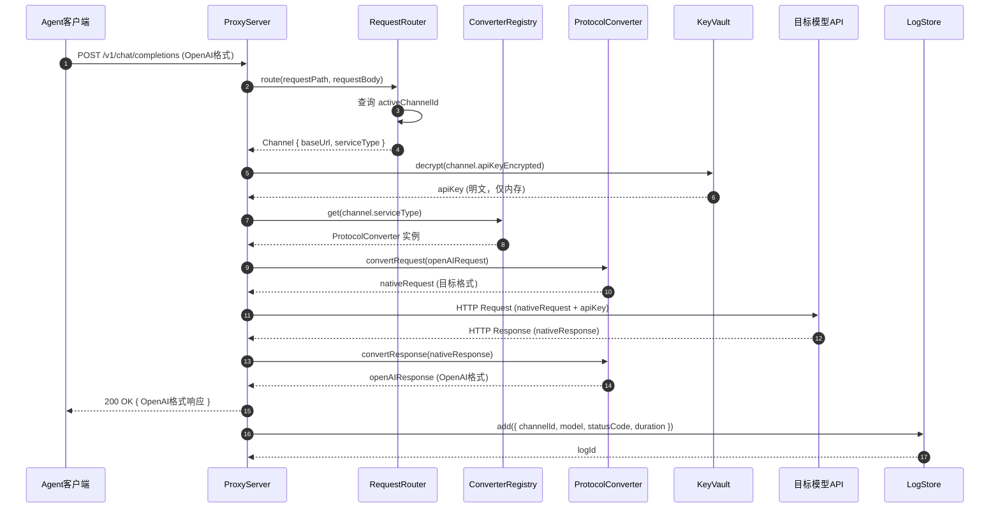
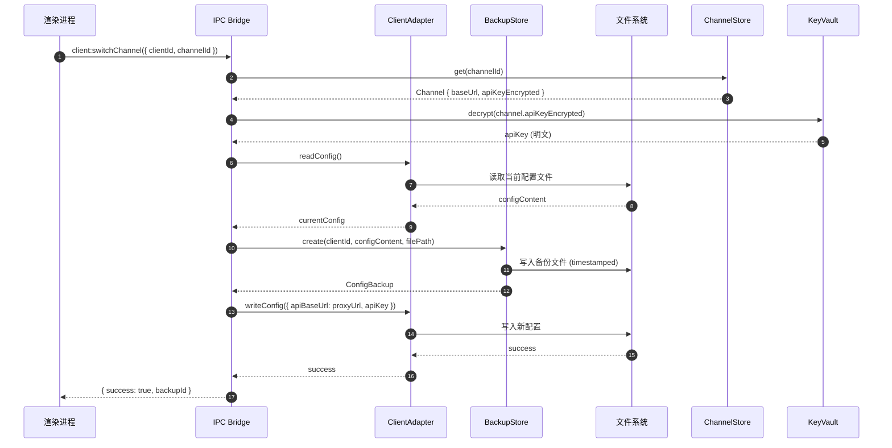
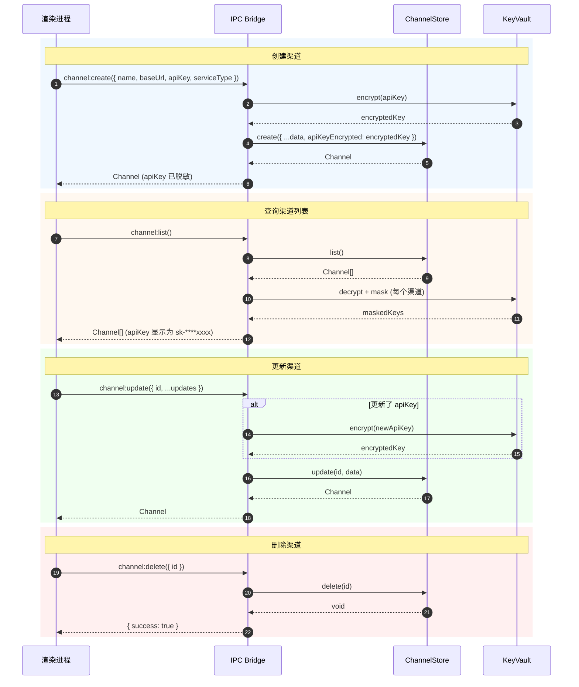
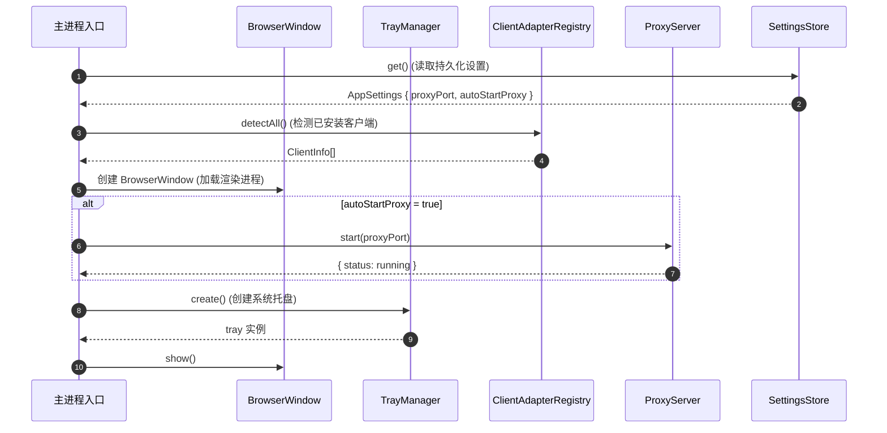
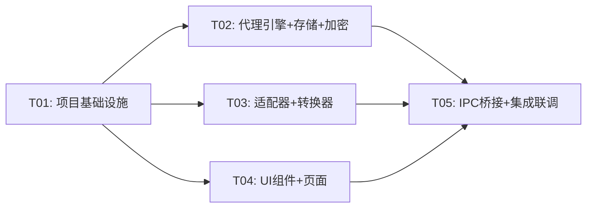

# Codex-Switch 系统架构设计文档

> 版本：v1.0.0 | 架构师：Gao | 日期：2025-06-03

---

## 目录

1. [实现方案与框架选型](#1-实现方案与框架选型)
2. [文件列表及相对路径](#2-文件列表及相对路径)
3. [数据结构与接口（类图）](#3-数据结构与接口类图)
4. [程序调用流程（时序图）](#4-程序调用流程时序图)
5. [任务列表](#5-任务列表)
6. [依赖包列表](#6-依赖包列表)
7. [共享知识（跨文件约定）](#7-共享知识跨文件约定)
8. [待明确事项](#8-待明确事项)

---

## 1. 实现方案与框架选型

### 1.1 核心技术挑战

| # | 挑战 | 分析 | 解决策略 |
|---|------|------|----------|
| C1 | **代理引擎** | 在 Electron 主进程中运行 HTTP 代理服务器，需稳定接收请求、路由分发、转发响应 | 使用 Node.js 内置 `http` 模块，轻量无外部依赖；缓冲转发模式（MVP 不支持 SSE） |
| C2 | **协议转换** | OpenAI `/v1/chat/completions` 格式 ↔ Claude/Gemini 等原生格式的双向转换 | 策略模式 + 转换器注册表，每种 ServiceType 对应一个 Converter 实现 |
| C3 | **客户端配置适配** | 四款 Agent 客户端（Codex/WorkBuddy/Qorder/OpenClaw）配置文件路径和格式各异 | 适配器模式，每个客户端实现统一 `IClientAdapter` 接口，内部处理各自的路径发现与格式解析 |
| C4 | **API Key 安全** | 密钥不以明文落盘 | Electron `safeStorage` 加密后存储，运行时解密仅在主进程内存中 |
| C5 | **配置备份与回滚** | 修改客户端配置前需自动备份，支持版本列表和一键回滚 | 基于时间戳的快照文件 + 元数据索引，备份文件存储于 app 数据目录 |

### 1.2 架构模式

采用 **Electron 主从架构 + 分层设计**：

```
┌─────────────────────────────────────────────────────────┐
│                    Electron Application                  │
├──────────────────────────┬──────────────────────────────┤
│      主进程 (Main)        │      渲染进程 (Renderer)      │
│                          │                              │
│  ┌──────────────────┐   │   ┌──────────────────────┐   │
│  │   Proxy Engine    │   │   │   React UI (MUI)     │   │
│  │   ┌────────────┐ │   │   │   ┌──────────────┐   │   │
│  │   │ HTTP Server│ │   │   │   │   Pages       │   │   │
│  │   │ Router     │ │   │   │   │   Components  │   │   │
│  │   │ Converter  │ │   │   │   └──────────────┘   │   │
│  │   └────────────┘ │   │   │   ┌──────────────┐   │   │
│  │   Store / Crypto  │   │   │   │   Hooks       │   │   │
│  │   Client Adapter  │   │   │   │   Context     │   │   │
│  │   Tray Manager    │   │   │   └──────────────┘   │   │
│  └──────────────────┘   │   └──────────────────────┘   │
│                          │                              │
├──────────────────────────┴──────────────────────────────┤
│               IPC Bridge (contextBridge)                 │
│               Preload Script (preload/index.ts)          │
└─────────────────────────────────────────────────────────┘
```

**主进程职责**：
- 代理服务器（HTTP Server）的启动/停止/重启
- 协议转换引擎的调度
- 文件系统操作（客户端配置读写、备份管理）
- API Key 加解密（safeStorage）
- 系统托盘管理
- 应用设置持久化

**渲染进程职责**：
- UI 渲染与用户交互
- 通过 IPC 调用主进程能力（不直接访问 Node.js API）
- 本地状态管理（React Context + Hooks）

**Preload 脚本**：
- 通过 `contextBridge.exposeInMainWorld` 暴露安全的 IPC 调用接口
- 渲染进程通过 `window.api.xxx()` 调用主进程能力

### 1.3 框架与库选型

| 层次 | 技术 | 选型理由 |
|------|------|----------|
| **桌面框架** | Electron 28+ | 成熟的跨平台桌面应用框架，内置 safeStorage、Tray、BrowserWindow 等 |
| **构建工具** | electron-vite 2.x | 专为 Electron 设计的 Vite 构建方案，自动处理 main/preload/renderer 三端编译 |
| **前端框架** | React 18 | 组件化、Hooks 友好、生态丰富 |
| **UI 组件库** | MUI 5 | Material Design 风格，企业级组件质量，Table/Dialog/Form 组件齐全 |
| **CSS 方案** | Tailwind CSS 3 | 原子化 CSS，与 MUI 互补（MUI 负责组件，Tailwind 负责布局与自定义样式） |
| **路由** | React Router 6 | 声明式路由，支持嵌套路由 |
| **数据持久化** | electron-store 8 | 基于 JSON 文件的轻量存储，支持加密、schema 校验，适合桌面应用配置场景 |
| **加密** | Electron safeStorage | 系统级加密（Windows DPAPI），密钥由 OS 管理，安全性高 |
| **TOML 解析** | smol-toml | 轻量、纯 JS 实现，用于读写 Codex 的 config.toml |
| **日期处理** | dayjs | 轻量（2KB），格式化日志时间戳 |
| **ID 生成** | uuid v9 | 生成唯一 ID（渠道、备份、日志记录等） |
| **打包** | electron-builder | 功能完善，支持 NSIS 安装包、自动更新 |

### 1.4 代理引擎架构

```
                          ┌─────────────────┐
  Agent Client ──────────▶│  ProxyServer    │
  (Codex/WorkBuddy/...)   │  (localhost:PORT)│
                          └───────┬─────────┘
                                  │
                          ┌───────▼─────────┐
                          │  RequestRouter   │
                          │  (渠道路由)       │
                          └───────┬─────────┘
                                  │
                    ┌─────────────┼─────────────┐
                    │             │             │
            ┌───────▼───┐ ┌──────▼────┐ ┌─────▼──────┐
            │ OpenAI    │ │ Claude    │ │ DeepSeek   │
            │ Converter │ │ Converter │ │ Converter  │
            │ (直通)     │ │ (格式转换) │ │ (直通)      │
            └───────┬───┘ └──────┬────┘ └─────┬──────┘
                    │            │             │
                    └──────┬─────┘─────────────┘
                           │
                    ┌──────▼──────┐
                    │  Forwarder  │
                    │  (HTTP转发)  │
                    └──────┬──────┘
                           │
              ┌────────────┼────────────┐
              ▼            ▼            ▼
         api.openai   api.anthropic  api.deepseek
```

**缓冲转发模式**（MVP）：
1. 接收完整请求体 → 2. 协议转换 → 3. 转发至目标 API → 4. 接收完整响应 → 5. 逆向转换 → 6. 返回客户端

**后续迭代**：可切换为流式转发模式，代理引擎作为 SSE 管道实时转发 chunk。

---

## 2. 文件列表及相对路径

```
codex-switch/
├── src/
│   ├── main/                            # Electron 主进程
│   │   ├── index.ts                     # 主进程入口（创建窗口、注册IPC、启动代理）
│   │   ├── ipc/                         # IPC 处理器
│   │   │   ├── index.ts                 # IPC 注册入口（统一注册所有 handler）
│   │   │   ├── proxy-handlers.ts        # 代理服务相关 IPC
│   │   │   ├── channel-handlers.ts      # 渠道管理相关 IPC
│   │   │   ├── client-handlers.ts       # 客户端配置相关 IPC
│   │   │   ├── log-handlers.ts          # 日志查询相关 IPC
│   │   │   └── settings-handlers.ts     # 设置管理相关 IPC
│   │   ├── proxy/                       # 代理引擎
│   │   │   ├── server.ts                # HTTP 代理服务器（启动/停止/请求处理）
│   │   │   ├── router.ts                # 请求路由（根据活跃渠道分发）
│   │   │   └── middleware.ts            # 中间件（请求日志记录、错误处理）
│   │   ├── converter/                   # 协议转换器
│   │   │   ├── base.ts                  # IProtocolConverter 接口定义
│   │   │   ├── registry.ts              # 转换器注册表（按 serviceType 查找）
│   │   │   ├── openai.ts                # OpenAI 格式直通（无转换）
│   │   │   ├── claude.ts                # Claude Messages API 格式适配
│   │   │   ├── deepseek.ts              # DeepSeek 格式适配（OpenAI 兼容，含模型名映射）
│   │   │   ├── gemini.ts                # Gemini generateContent 格式适配
│   │   │   ├── qwen.ts                  # 通义千问格式适配（OpenAI 兼容）
│   │   │   └── zhipu.ts                 # 智谱格式适配（OpenAI 兼容）
│   │   ├── client-adapter/              # 客户端适配器
│   │   │   ├── base.ts                  # IClientAdapter 接口定义
│   │   │   ├── registry.ts              # 适配器注册表
│   │   │   ├── codex.ts                 # Codex 适配器（config.toml + auth.json）
│   │   │   ├── workbuddy.ts             # WorkBuddy 适配器
│   │   │   ├── qorder.ts                # Qorder 适配器
│   │   │   └── openclaw.ts              # OpenClaw 适配器
│   │   ├── store/                       # 数据存储
│   │   │   ├── channel-store.ts         # 渠道数据 CRUD
│   │   │   ├── backup-store.ts          # 配置备份管理
│   │   │   ├── log-store.ts             # 请求日志存储
│   │   │   └── settings-store.ts        # 应用设置存储
│   │   ├── crypto/                      # 加密模块
│   │   │   └── key-vault.ts             # API Key 加解密（safeStorage 封装）
│   │   └── tray/                        # 系统托盘
│   │       └── tray-manager.ts          # 托盘菜单创建与事件处理
│   │
│   ├── preload/                         # Preload 脚本
│   │   └── index.ts                     # contextBridge 暴露安全 API
│   │
│   ├── renderer/                        # 渲染进程（React）
│   │   ├── main.tsx                     # React 入口（挂载根组件）
│   │   ├── App.tsx                      # App 根组件（路由 + Context Provider）
│   │   ├── theme/                       # 主题
│   │   │   ├── theme.ts                 # MUI 主题配置（字体、圆角、阴影）
│   │   │   └── palette.ts              # 色彩体系（主色、语义色）
│   │   ├── pages/                       # 页面组件
│   │   │   ├── Dashboard.tsx            # 仪表盘
│   │   │   ├── Channels.tsx             # 渠道管理
│   │   │   ├── ClientConfig.tsx         # 客户端配置
│   │   │   ├── Logs.tsx                 # 请求日志
│   │   │   └── Settings.tsx             # 应用设置
│   │   ├── components/                  # UI 组件
│   │   │   ├── layout/                  # 布局组件
│   │   │   │   ├── AppLayout.tsx        # 主布局（侧边栏 + 内容区 + 状态栏）
│   │   │   │   ├── Sidebar.tsx          # 左侧导航栏
│   │   │   │   └── StatusBar.tsx        # 底部状态栏
│   │   │   ├── dashboard/               # 仪表盘子组件
│   │   │   │   ├── ProxyStatus.tsx      # 代理状态卡片
│   │   │   │   ├── StatsCards.tsx       # 统计卡片组
│   │   │   │   └── RecentLogs.tsx       # 最近日志预览
│   │   │   ├── channels/                # 渠道管理子组件
│   │   │   │   ├── ChannelList.tsx      # 渠道卡片列表
│   │   │   │   ├── ChannelCard.tsx      # 单个渠道卡片
│   │   │   │   ├── ChannelForm.tsx      # 渠道编辑对话框
│   │   │   │   └── ChannelTest.tsx      # 连通性测试组件
│   │   │   ├── clients/                 # 客户端配置子组件
│   │   │   │   ├── ClientList.tsx       # 客户端列表
│   │   │   │   ├── ClientCard.tsx       # 单个客户端卡片
│   │   │   │   └── BackupHistory.tsx    # 备份历史列表
│   │   │   ├── logs/                    # 日志子组件
│   │   │   │   ├── LogTable.tsx         # 日志数据表格
│   │   │   │   └── LogDetail.tsx        # 日志详情抽屉
│   │   │   └── common/                  # 通用组件
│   │   │       ├── ConfirmDialog.tsx    # 确认对话框
│   │   │       ├── LoadingOverlay.tsx   # 加载遮罩
│   │   │       └── NotificationSnackbar.tsx # 消息提示
│   │   ├── hooks/                       # React Hooks
│   │   │   ├── useProxy.ts             # 代理状态 Hook
│   │   │   ├── useChannels.ts          # 渠道数据 Hook
│   │   │   ├── useClients.ts           # 客户端配置 Hook
│   │   │   └── useSettings.ts          # 设置 Hook
│   │   ├── contexts/                    # React Context
│   │   │   └── AppContext.tsx           # 全局状态（代理状态、通知等）
│   │   └── utils/                       # 工具函数
│   │       ├── ipc.ts                  # IPC 调用封装（类型安全）
│   │       └── formatters.ts           # 日期/大小格式化
│   │
│   └── shared/                          # 主进程与渲染进程共享
│       └── types/                       # 共享类型定义
│           ├── channel.ts               # 渠道相关类型
│           ├── client.ts                # 客户端相关类型
│           ├── proxy.ts                 # 代理服务相关类型
│           ├── log.ts                   # 日志相关类型
│           ├── settings.ts              # 设置相关类型
│           └── ipc.ts                   # IPC 通道名称与参数类型
│
├── resources/                           # 静态资源
│   └── icon.png                         # 应用图标（256x256）
│
├── package.json                         # 项目依赖与脚本
├── electron.vite.config.ts             # electron-vite 构建配置
├── electron-builder.yml                # electron-builder 打包配置
├── tsconfig.json                       # TypeScript 根配置
├── tsconfig.node.json                  # Node 环境 TS 配置（主进程）
├── tsconfig.web.json                   # Web 环境 TS 配置（渲染进程）
├── tailwind.config.ts                  # Tailwind CSS 配置
├── postcss.config.js                   # PostCSS 配置
└── index.html                          # HTML 入口（渲染进程）
```

---

## 3. 数据结构与接口（类图）

详见 [`class-diagram.mermaid`](./class-diagram.mermaid)。

```mermaid
classDiagram
    direction TB

    class ProxyServer {
        -port: number
        -status: ProxyStatus
        -httpServer: Server
        -activeChannelId: string|null
        -router: RequestRouter
        -middleware: Middleware[]
        +start(port: number): Promise~void~
        +stop(): Promise~void~
        +restart(): Promise~void~
        +getStatus(): ProxyStatusInfo
        +setActiveChannel(channelId: string): void
        -handleRequest(req: IncomingMessage, res: ServerResponse): void
    }

    class RequestRouter {
        -channelStore: ChannelStore
        +route(path: string, body: unknown): Channel
        +resolveTargetUrl(channel: Channel, path: string): string
    }

    class IProtocolConverter {
        <<interface>>
        +serviceType: ServiceType
        +convertRequest(req: OpenAIChatRequest): NativeRequest
        +convertResponse(res: NativeResponse): OpenAIChatResponse
    }

    class OpenAIConverter {
        +serviceType: ServiceType.OPENAI
        +convertRequest(req): OpenAIChatRequest
        +convertResponse(res): OpenAIChatResponse
    }

    class ClaudeConverter {
        +serviceType: ServiceType.CLAUDE
        +convertRequest(req): ClaudeMessagesRequest
        +convertResponse(res): OpenAIChatResponse
    }

    class GeminiConverter {
        +serviceType: ServiceType.GEMINI
        +convertRequest(req): GeminiGenerateRequest
        +convertResponse(res): OpenAIChatResponse
    }

    class ConverterRegistry {
        -converters: Map~ServiceType, IProtocolConverter~
        +register(converter: IProtocolConverter): void
        +get(serviceType: ServiceType): IProtocolConverter
    }

    class IClientAdapter {
        <<interface>>
        +clientType: ClientType
        +detect(): boolean
        +getConfigPaths(): string[]
        +readConfig(): ClientConfig
        +writeConfig(config: ClientConfig): void
        +backupConfig(): ConfigBackup
        +restoreConfig(backupId: string): void
        +listBackups(): ConfigBackup[]
    }

    class CodexAdapter {
        +clientType: ClientType.CODEX
        -configTomlPath: string
        -authJsonPath: string
        +detect(): boolean
        +readConfig(): ClientConfig
        +writeConfig(config): void
        +backupConfig(): ConfigBackup
    }

    class WorkBuddyAdapter {
        +clientType: ClientType.WORKBUDDY
        -configJsonPath: string
        +detect(): boolean
        +readConfig(): ClientConfig
        +writeConfig(config): void
    }

    class QorderAdapter {
        +clientType: ClientType.QORDER
        -configJsonPath: string
        +detect(): boolean
        +readConfig(): ClientConfig
        +writeConfig(config): void
    }

    class OpenClawAdapter {
        +clientType: ClientType.OPENCLAW
        -configJsonPath: string
        +detect(): boolean
        +readConfig(): ClientConfig
        +writeConfig(config): void
    }

    class ClientAdapterRegistry {
        -adapters: Map~ClientType, IClientAdapter~
        +register(adapter: IClientAdapter): void
        +get(clientType: ClientType): IClientAdapter
        +detectAll(): ClientInfo[]
    }

    class ChannelStore {
        -store: Store
        +list(): Channel[]
        +get(id: string): Channel|null
        +create(data: CreateChannelDTO): Channel
        +update(id: string, data: UpdateChannelDTO): Channel
        +delete(id: string): void
    }

    class BackupStore {
        -backupDir: string
        +create(clientId: string, content: string, filePath: string): ConfigBackup
        +list(clientId: string): ConfigBackup[]
        +get(backupId: string): ConfigBackup|null
        +restore(backupId: string): void
        +getContent(backupId: string): string
    }

    class LogStore {
        -store: Store
        +add(log: Omit~RequestLog, id~): RequestLog
        +list(filters: LogFilters): RequestLog[]
        +clear(): void
        +getStats(): LogStats
    }

    class SettingsStore {
        -store: Store
        +get(): AppSettings
        +update(partial: Partial~AppSettings~): AppSettings
    }

    class KeyVault {
        -safeStorage: Electron.safeStorage
        +encrypt(plaintext: string): string
        +decrypt(ciphertext: string): string
        +isEncrypted(value: string): boolean
    }

    class TrayManager {
        -tray: Tray
        -proxyServer: ProxyServer
        +create(): void
        +updateStatus(status: ProxyStatusInfo): void
        +destroy(): void
    }

    %% 数据模型
    class Channel {
        +id: string
        +name: string
        +serviceType: ServiceType
        +baseUrl: string
        +apiKeyEncrypted: string
        +models: string[]
        +isActive: boolean
        +createdAt: string
        +updatedAt: string
    }

    class ClientConfig {
        +apiBaseUrl: string
        +apiKey: string
        +model: string
        +extra: Record~string, unknown~
    }

    class ClientInfo {
        +clientType: ClientType
        +name: string
        +detected: boolean
        +configPaths: string[]
        +currentConfig: ClientConfig|null
        +linkedChannelId: string|null
    }

    class ConfigBackup {
        +id: string
        +clientId: string
        +filePath: string
        +timestamp: string
        +size: number
    }

    class RequestLog {
        +id: string
        +channelId: string
        +channelName: string
        +model: string
        +method: string
        +path: string
        +statusCode: number
        +duration: number
        +timestamp: string
    }

    class AppSettings {
        +proxyPort: number
        +autoStartProxy: boolean
        +autoLaunch: boolean
        +language: string
        +dataPath: string
    }

    %% 关系
    ProxyServer --> RequestRouter : uses
    ProxyServer --> ConverterRegistry : uses
    ProxyServer --> ChannelStore : uses
    ProxyServer --> LogStore : uses
    ProxyServer --> KeyVault : uses
    ProxyServer --> TrayManager : notifies

    RequestRouter --> Channel : returns

    IProtocolConverter <|.. OpenAIConverter : implements
    IProtocolConverter <|.. ClaudeConverter : implements
    IProtocolConverter <|.. GeminiConverter : implements
    ConverterRegistry --> IProtocolConverter : manages

    IClientAdapter <|.. CodexAdapter : implements
    IClientAdapter <|.. WorkBuddyAdapter : implements
    IClientAdapter <|.. QorderAdapter : implements
    IClientAdapter <|.. OpenClawAdapter : implements
    ClientAdapterRegistry --> IClientAdapter : manages

    ChannelStore --> Channel : CRUD
    BackupStore --> ConfigBackup : CRUD
    LogStore --> RequestLog : CRUD
    SettingsStore --> AppSettings : get/update
    KeyVault ..> Channel : encrypt/decrypt apiKey
```



### 枚举类型定义

```typescript
// ServiceType - 模型服务类型
enum ServiceType {
  OPENAI = 'openai',
  CLAUDE = 'claude',
  DEEPSEEK = 'deepseek',
  GEMINI = 'gemini',
  QWEN = 'qwen',
  ZHIPU = 'zhipu',
  CUSTOM = 'custom',
}

// ClientType - 客户端类型
enum ClientType {
  CODEX = 'codex',
  WORKBUDDY = 'workbuddy',
  QORDER = 'qorder',
  OPENCLAW = 'openclaw',
}

// ProxyStatus - 代理服务状态
enum ProxyStatus {
  RUNNING = 'running',
  STOPPED = 'stopped',
  ERROR = 'error',
}
```

### 预置模型模板

```typescript
// 内置渠道模板，用户可一键创建
const CHANNEL_TEMPLATES: ChannelTemplate[] = [
  {
    serviceType: ServiceType.OPENAI,
    name: 'OpenAI',
    baseUrl: 'https://api.openai.com',
    defaultModels: ['gpt-4o', 'gpt-4o-mini', 'gpt-4-turbo', 'o1', 'o1-mini'],
  },
  {
    serviceType: ServiceType.CLAUDE,
    name: 'Claude',
    baseUrl: 'https://api.anthropic.com',
    defaultModels: ['claude-sonnet-4-20250514', 'claude-3-5-haiku-20241022', 'claude-3-5-sonnet-20241022'],
  },
  {
    serviceType: ServiceType.DEEPSEEK,
    name: 'DeepSeek',
    baseUrl: 'https://api.deepseek.com',
    defaultModels: ['deepseek-chat', 'deepseek-reasoner'],
  },
  {
    serviceType: ServiceType.GEMINI,
    name: 'Gemini',
    baseUrl: 'https://generativelanguage.googleapis.com',
    defaultModels: ['gemini-2.0-flash', 'gemini-2.0-flash-lite', 'gemini-1.5-pro'],
  },
  {
    serviceType: ServiceType.QWEN,
    name: '通义千问',
    baseUrl: 'https://dashscope.aliyuncs.com/compatible-mode',
    defaultModels: ['qwen-turbo', 'qwen-plus', 'qwen-max', 'qwq-32b'],
  },
  {
    serviceType: ServiceType.ZHIPU,
    name: '智谱',
    baseUrl: 'https://open.bigmodel.cn/api/paas',
    defaultModels: ['glm-4-plus', 'glm-4-flash', 'glm-4'],
  },
]
```

---

## 4. 程序调用流程（时序图）

详见 [`sequence-diagram.mermaid`](./sequence-diagram.mermaid)。

### 4.1 请求代理转发流程



### 4.2 客户端配置切换流程



### 4.3 渠道管理 CRUD 流程



### 4.4 应用启动初始化流程



---

## 5. 任务列表

| # | 任务 | 依赖 | 优先级 | 预计文件 | 说明 |
|---|------|------|--------|----------|------|
| T01 | **项目基础设施** | 无 | P0 | `package.json`, `electron.vite.config.ts`, `electron-builder.yml`, `tsconfig.json`, `tsconfig.node.json`, `tsconfig.web.json`, `tailwind.config.ts`, `postcss.config.js`, `index.html`, `src/main/index.ts`, `src/preload/index.ts`, `src/renderer/main.tsx`, `src/renderer/App.tsx`, `src/shared/types/*.ts` | 初始化项目骨架：依赖声明、构建配置、Electron 主/预加载/渲染三端入口、共享类型定义 |
| T02 | **代理引擎 + 数据存储 + 加密** | T01 | P0 | `src/main/proxy/server.ts`, `src/main/proxy/router.ts`, `src/main/proxy/middleware.ts`, `src/main/converter/base.ts`, `src/main/converter/registry.ts`, `src/main/converter/openai.ts`, `src/main/store/channel-store.ts`, `src/main/store/backup-store.ts`, `src/main/store/log-store.ts`, `src/main/store/settings-store.ts`, `src/main/crypto/key-vault.ts` | 核心后端：代理服务器、请求路由、协议转换基础架构（注册表+OpenAI直通）、四个数据存储、KeyVault 加密 |
| T03 | **客户端适配器 + 协议转换器** | T01 | P0 | `src/main/client-adapter/base.ts`, `src/main/client-adapter/registry.ts`, `src/main/client-adapter/codex.ts`, `src/main/client-adapter/workbuddy.ts`, `src/main/client-adapter/qorder.ts`, `src/main/client-adapter/openclaw.ts`, `src/main/converter/claude.ts`, `src/main/converter/deepseek.ts`, `src/main/converter/gemini.ts`, `src/main/converter/qwen.ts`, `src/main/converter/zhipu.ts` | 四款客户端适配器实现（路径发现、配置读写、备份管理）+ 五个协议转换器（Claude/Gemini 真实转换 + DeepSeek/Qwen/Zhipu OpenAI 兼容适配） |
| T04 | **UI 组件 + 页面** | T01 | P0 | `src/renderer/theme/*.ts`, `src/renderer/components/layout/*.tsx`, `src/renderer/components/dashboard/*.tsx`, `src/renderer/components/channels/*.tsx`, `src/renderer/components/clients/*.tsx`, `src/renderer/components/logs/*.tsx`, `src/renderer/components/common/*.tsx`, `src/renderer/pages/*.tsx` | 全部 UI 层：MUI 主题、布局框架、5 个页面、各业务子组件、通用组件 |
| T05 | **IPC 桥接 + Hooks + 集成联调** | T02, T03, T04 | P0 | `src/main/ipc/*.ts`, `src/main/tray/tray-manager.ts`, `src/renderer/hooks/*.ts`, `src/renderer/contexts/AppContext.tsx`, `src/renderer/utils/ipc.ts`, `src/renderer/utils/formatters.ts` | IPC 处理器注册、React Hooks 封装、全局 Context、系统托盘、工具函数；最终联调确保主进程↔渲染进程通信正常 |

### 任务依赖图



> **并行度说明**：T02、T03、T04 三个任务在 T01 完成后可并行开发，互不依赖。T05 作为最终集成任务，需等待 T02/T03/T04 全部完成。

---

## 6. 依赖包列表

### 核心依赖（dependencies）

| 包名 | 版本 | 用途 |
|------|------|------|
| `react` | ^18.2.0 | UI 框架 |
| `react-dom` | ^18.2.0 | React DOM 渲染 |
| `react-router-dom` | ^6.20.0 | 客户端路由 |
| `@mui/material` | ^5.14.0 | Material UI 组件库 |
| `@mui/icons-material` | ^5.14.0 | MUI 图标集 |
| `@emotion/react` | ^11.11.0 | MUI 样式引擎（CSS-in-JS） |
| `@emotion/styled` | ^11.11.0 | MUI styled API |
| `electron-store` | ^8.1.0 | 主进程 JSON 持久化存储 |
| `smol-toml` | ^1.3.0 | TOML 文件解析（Codex config.toml） |
| `uuid` | ^9.0.0 | 唯一 ID 生成 |
| `dayjs` | ^1.11.0 | 日期格式化 |

### 开发依赖（devDependencies）

| 包名 | 版本 | 用途 |
|------|------|------|
| `electron` | ^28.0.0 | Electron 运行时 |
| `electron-vite` | ^2.0.0 | Electron 专用 Vite 构建工具 |
| `electron-builder` | ^24.9.0 | 应用打包与分发 |
| `typescript` | ^5.3.0 | TypeScript 编译器 |
| `vite` | ^5.0.0 | 前端构建工具 |
| `@vitejs/plugin-react` | ^4.2.0 | Vite React 插件 |
| `tailwindcss` | ^3.4.0 | 原子化 CSS 框架 |
| `postcss` | ^8.4.0 | CSS 转换工具 |
| `autoprefixer` | ^10.4.0 | CSS 前缀自动补全 |
| `@types/react` | ^18.2.0 | React 类型定义 |
| `@types/react-dom` | ^18.2.0 | React DOM 类型定义 |
| `@types/uuid` | ^9.0.0 | uuid 类型定义 |
| `eslint` | ^8.55.0 | 代码检查 |
| `prettier` | ^3.1.0 | 代码格式化 |

---

## 7. 共享知识（跨文件约定）

### 7.1 代码风格与命名规范

| 规则 | 约定 | 示例 |
|------|------|------|
| 文件命名 | kebab-case | `channel-store.ts`, `proxy-handlers.ts` |
| 类/接口命名 | PascalCase，接口以 `I` 前缀 | `IProtocolConverter`, `ProxyServer` |
| 函数/变量 | camelCase | `getActiveChannel()`, `proxyPort` |
| 常量 | UPPER_SNAKE_CASE | `DEFAULT_PROXY_PORT`, `IPC_CHANNELS` |
| 类型/枚举 | PascalCase | `ServiceType`, `Channel`, `ProxyStatus` |
| React 组件 | PascalCase，与文件名一致 | `ChannelCard.tsx` → `ChannelCard` |
| React Hooks | use 前缀 | `useChannels`, `useProxy` |
| CSS 类名 | Tailwind 原子类优先，自定义类 BEM | `tw-flex tw-gap-4` 或 `channel-card__title` |

### 7.2 IPC 通信协议

**通道命名规范**：`<domain>:<action>`

| 通道名 | 方向 | 参数 | 返回值 |
|--------|------|------|--------|
| `proxy:start` | R→M | `{ port: number }` | `{ success: boolean, port: number }` |
| `proxy:stop` | R→M | `void` | `{ success: boolean }` |
| `proxy:status` | R→M | `void` | `ProxyStatusInfo` |
| `proxy:set-channel` | R→M | `{ channelId: string }` | `{ success: boolean }` |
| `channel:list` | R→M | `void` | `Channel[]`（apiKey 脱敏） |
| `channel:get` | R→M | `{ id: string }` | `Channel`（apiKey 脱敏） |
| `channel:create` | R→M | `CreateChannelDTO` | `Channel` |
| `channel:update` | R→M | `{ id: string, ...updates }` | `Channel` |
| `channel:delete` | R→M | `{ id: string }` | `{ success: boolean }` |
| `channel:test` | R→M | `{ id: string }` | `{ success: boolean, latency: number, models: string[] }` |
| `client:list` | R→M | `void` | `ClientInfo[]` |
| `client:switch-channel` | R→M | `{ clientType: string, channelId: string }` | `{ success: boolean, backupId: string }` |
| `client:restore` | R→M | `{ clientType: string, backupId: string }` | `{ success: boolean }` |
| `client:backups` | R→M | `{ clientType: string }` | `ConfigBackup[]` |
| `log:list` | R→M | `LogFilters` | `RequestLog[]` |
| `log:clear` | R→M | `void` | `{ success: boolean }` |
| `settings:get` | R→M | `void` | `AppSettings` |
| `settings:update` | R→M | `Partial<AppSettings>` | `AppSettings` |

**方向说明**：R→M = 渲染进程调用主进程（invoke 模式）

**主进程→渲染进程事件推送**：

| 事件名 | 触发时机 | 数据 |
|--------|----------|------|
| `proxy:status-changed` | 代理状态变更 | `ProxyStatusInfo` |
| `log:new` | 新请求日志产生 | `RequestLog` |
| `client:config-changed` | 客户端配置被修改 | `{ clientType: string }` |

### 7.3 错误处理约定

```typescript
// 统一错误类型
class AppError extends Error {
  constructor(
    public code: ErrorCode,
    message: string,
    public details?: unknown
  ) {
    super(message)
  }
}

enum ErrorCode {
  // 代理引擎 (1xxx)
  PROXY_START_FAILED = 1001,
  PROXY_PORT_IN_USE = 1002,
  PROXY_FORWARD_FAILED = 1003,
  PROXY_CONVERT_FAILED = 1004,

  // 渠道管理 (2xxx)
  CHANNEL_NOT_FOUND = 2001,
  CHANNEL_TEST_FAILED = 2002,

  // 客户端适配 (3xxx)
  CLIENT_NOT_DETECTED = 3001,
  CLIENT_CONFIG_READ_FAILED = 3002,
  CLIENT_CONFIG_WRITE_FAILED = 3003,
  CLIENT_BACKUP_FAILED = 3004,

  // 加密 (4xxx)
  ENCRYPTION_FAILED = 4001,
  DECRYPTION_FAILED = 4002,

  // 存储 (5xxx)
  STORE_READ_FAILED = 5001,
  STORE_WRITE_FAILED = 5002,
}
```

**IPC 错误传递**：主进程 IPC handler 中 catch 错误后，将 `AppError` 序列化为 `{ code, message, details }` 返回渲染进程，渲染进程根据 `code` 展示对应 UI 提示。

### 7.4 数据加密方案

| 数据 | 存储形式 | 加密方式 |
|------|----------|----------|
| API Key | `channel.apiKeyEncrypted` 字段 | `Electron.safeStorage.encryptString()` → Base64 编码 |
| 读取时 | 仅主进程内存中解密 | `Electron.safeStorage.decryptString()` → 明文仅用于 HTTP 请求头 |
| 其他配置 | 明文 JSON | electron-store 存储，不含敏感信息 |

**安全原则**：
- API Key 永远不通过 IPC 传输到渲染进程
- 渲染进程仅显示 `sk-****xxxx`（脱敏）
- 代理引擎转发时在主进程中解密并注入请求头
- safeStorage 底层使用 Windows DPAPI，密钥与 Windows 用户账户绑定

### 7.5 数据存储路径

```
%APPDATA%/codex-switch/
├── config.json              # electron-store 主配置（渠道、设置）
├── logs.json                # electron-store 日志数据
├── backups/                 # 配置备份目录
│   ├── codex/
│   │   ├── 2025-06-03T10-30-00_config.toml
│   │   └── 2025-06-03T10-30-00_auth.json
│   ├── workbuddy/
│   └── ...
└── app-icon.png             # 缓存的应用图标
```

### 7.6 四款客户端配置路径（假设）

| 客户端 | 配置文件路径 | 格式 | 需修改字段 |
|--------|-------------|------|-----------|
| **Codex** | `~/.codex/config.toml` + `~/.codex/auth.json` | TOML + JSON | `api_base_url`, `api_key`, `model` |
| **WorkBuddy** | `%APPDATA%/workbuddy/settings.json` | JSON | `api.baseUrl`, `api.key`, `api.model` |
| **Qorder** | `~/.qorder/config.json` | JSON | `openai.baseURL`, `openai.apiKey`, `openai.model` |
| **OpenClaw** | `%APPDATA%/openclaw/config.json` | JSON | `provider.endpoint`, `provider.apiKey`, `provider.model` |

> ⚠️ 以上路径为架构假设，需用户确认或提供实际配置文件样例。

---

## 8. 待明确事项

| # | 事项 | 影响范围 | 建议处理方式 |
|---|------|----------|-------------|
| U1 | **WorkBuddy/Qorder/OpenClaw 配置文件路径和格式** | `client-adapter/` 下四个适配器实现 | 需用户提供各客户端的配置文件样例，或安装后手动探测；当前按合理假设设计 |
| U2 | **Codex config.toml 具体字段名** | `codex.ts` 适配器 | 需确认 Codex 的 `config.toml` 中 API 地址和模型的字段名（如 `api_base_url` vs `apiBaseUrl`） |
| U3 | **Claude/Gemini 协议转换细节** | `claude.ts`, `gemini.ts` 转换器 | 需确认 Codex 等客户端发送的 OpenAI 格式请求中是否包含 system message、tool_calls 等需要特殊转换的字段 |
| U4 | **代理端口冲突处理策略** | `proxy/server.ts` | 当默认端口被占用时：A) 提示用户手动修改端口；B) 自动选择下一个可用端口。建议 MVP 用 A，后续支持 B |
| U5 | **客户端自动检测范围** | `client-adapter/registry.ts` | 是否需要扫描注册表/文件系统自动发现已安装的客户端？还是用户手动添加配置路径？建议 MVP 支持自动检测默认路径 + 手动指定路径 |
| U6 | **日志数据量管理** | `log-store.ts` | 请求日志是否需要定期清理？最大保留条数？建议默认保留最近 10000 条，设置页可配置 |
| U7 | **DeepSeek/Qwen/Zhipu 等国内模型的 API Key 传递方式** | 转发器 | 部分国内模型使用 URL query 参数而非 Header 传递 Key，需确认各服务商的认证方式 |
| U8 | **MVP 是否支持多渠道同时启用** | `proxy/router.ts` | MVP 是否只支持一个活跃渠道（所有请求转发到同一渠道），还是支持基于模型名称的路由？建议 MVP 仅支持单活跃渠道 |
