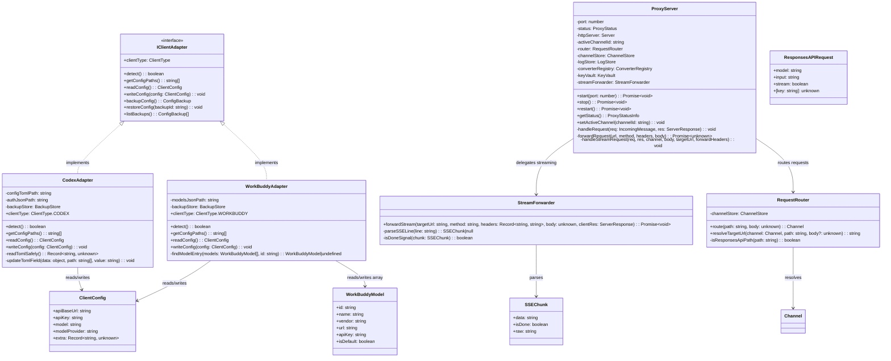
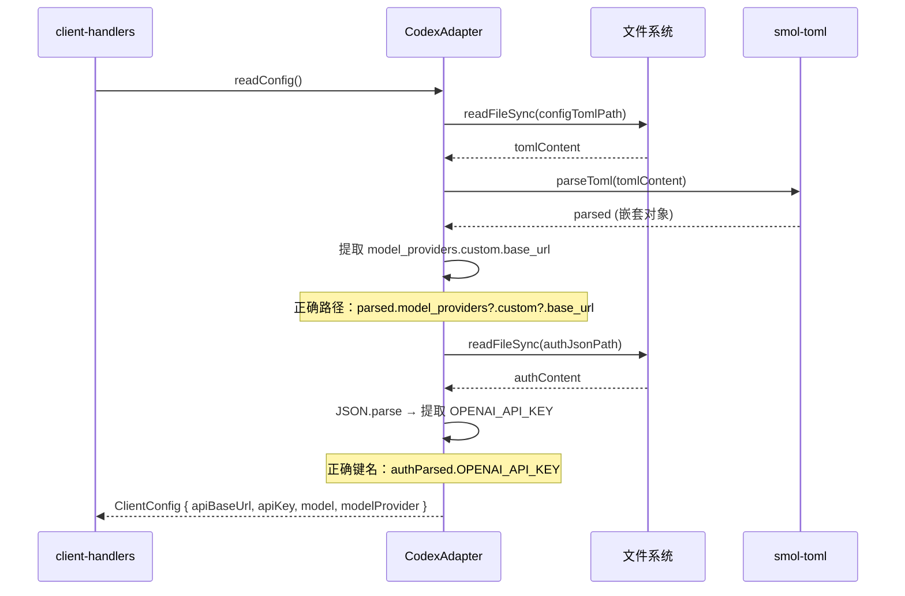
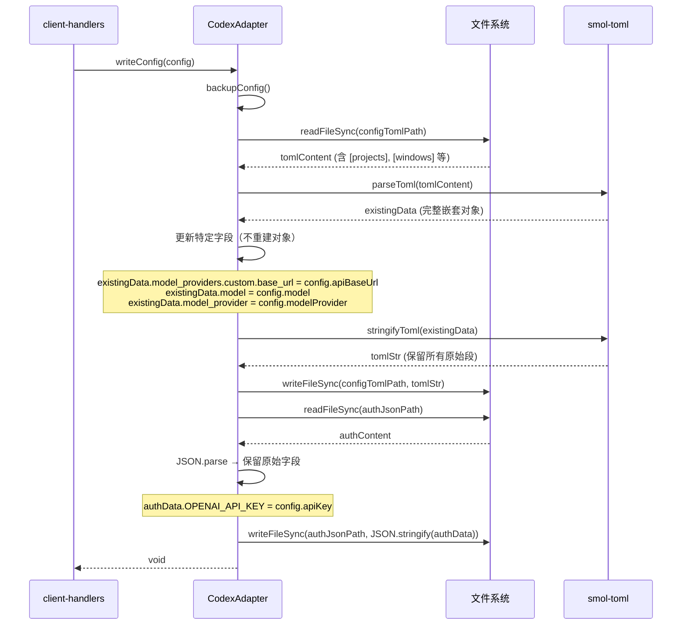
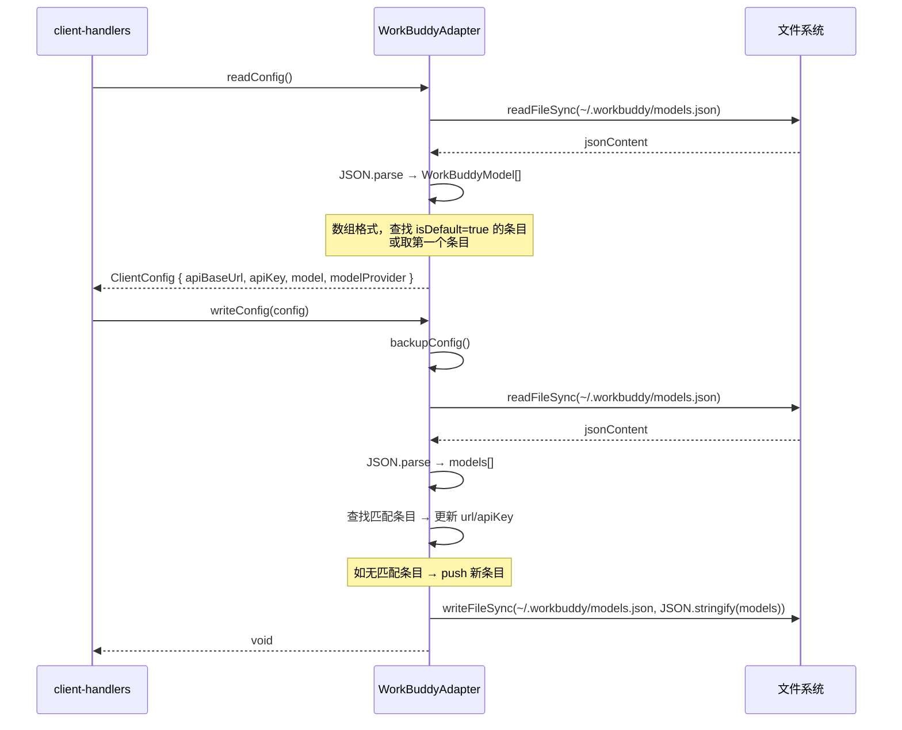
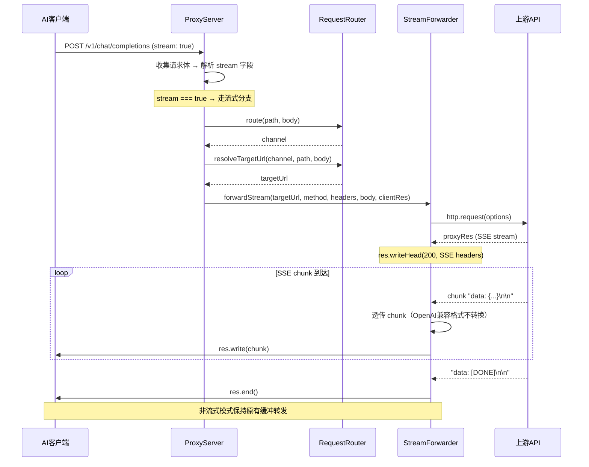
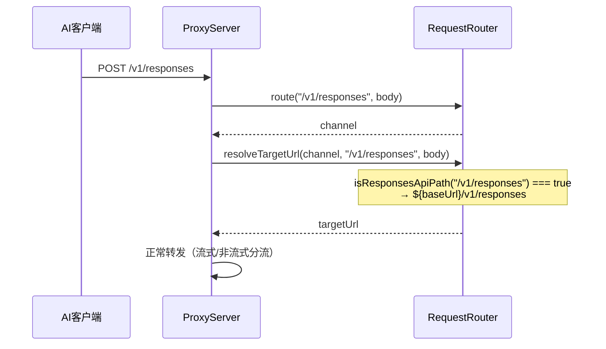
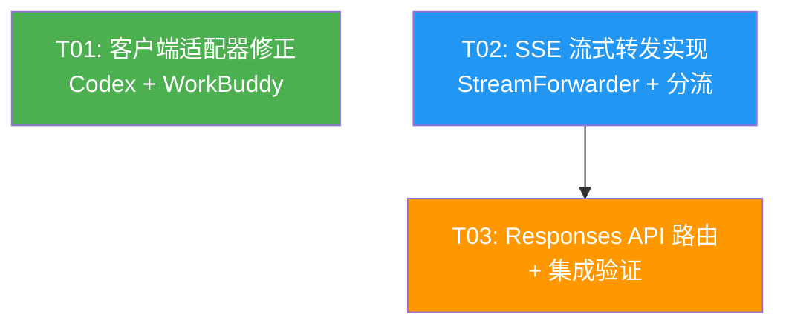

# Codex-Switch v1.1 系统架构设计

## Part A: 系统设计

---

### 1. 实现方案

#### 1.1 核心技术挑战

| 挑战 | 说明 | 方案 |
|------|------|------|
| Codex TOML 嵌套表读写 | `model_providers.custom.base_url` 是 TOML 嵌套表，当前代码用扁平键读取 | 用 `smol-toml` 的 `parse()` 返回嵌套对象，直接访问嵌套路径 |
| Codex TOML 安全写入 | 当前 `stringifyToml(tomlData)` 覆盖整个文件，丢失 `[projects]`/`[windows]` 等段 | 先 `parseToml` 原始内容 → 修改特定字段 → `stringifyToml` 写回完整对象 |
| WorkBuddy 数组格式 | `models.json` 是 JSON 数组而非单对象 | 重写 `readConfig`/`writeConfig` 处理数组查找/更新逻辑 |
| SSE 流式转发 | 当前 `forwardRequest` 完全缓冲，无法支持流式 | 新增 `forwardStreamRequest` 方法，用 Node.js http 模块的 stream pipe 实时转发 |
| 流式/非流式分流 | 需根据请求体 `stream` 字段决定转发模式 | 在 `handleRequest` 中解析 `stream` 字段，分支调用 `forwardRequest` 或 `forwardStreamRequest` |
| Responses API 路由 | `/v1/responses` 路径需要正确路由 | 在 `RequestRouter.resolveTargetUrl` 中新增 Responses API 路径映射 |

#### 1.2 框架与库选型

| 依赖 | 用途 | 说明 |
|------|------|------|
| `smol-toml` (已有) | TOML 解析/序列化 | 支持嵌套表结构，v1.0 已使用 |
| Node.js `http`/`https` (内置) | SSE 流式转发 | 无需新增依赖，直接使用 stream pipe |
| 无新增依赖 | — | v1.1 不引入新第三方包 |

#### 1.3 架构模式

沿用 v1.0 的分层架构：
- **适配器层**：修复 CodexAdapter / WorkBuddyAdapter
- **代理层**：扩展 ProxyServer 支持流式转发
- **路由层**：扩展 RequestRouter 支持 Responses API
- **类型层**：扩展共享类型定义

---

### 2. 文件列表

#### 需要修改的文件

| 文件路径 | 修改内容 |
|----------|----------|
| `src/main/client-adapter/codex.ts` | 修正 readConfig 嵌套表读取、修正 auth.json 键名、修正 writeConfig 保留现有段、新增 model_provider 字段 |
| `src/main/client-adapter/workbuddy.ts` | 修正路径为 `~/.workbuddy/models.json`、修正格式为 JSON 数组 |
| `src/main/proxy/server.ts` | 新增流式转发方法、handleRequest 中分流逻辑 |
| `src/main/proxy/router.ts` | 新增 `/v1/responses` 路径支持 |
| `src/main/converter/base.ts` | IProtocolConverter 接口无变更（流式模式下 OpenAI 兼容格式直通，不需要 converter） |
| `src/shared/types/proxy.ts` | 新增 SSE 相关类型定义、Responses API 类型 |
| `src/shared/types/client.ts` | ClientConfig 新增 modelProvider 字段 |
| `src/main/ipc/client-handlers.ts` | 切换渠道时传递 modelProvider 字段 |

#### 需要新增的文件

| 文件路径 | 说明 |
|----------|------|
| `src/main/proxy/stream.ts` | SSE 流式转发器（独立模块） |
| `src/main/__tests__/codex-adapter.test.ts` | Codex 适配器修正测试 |
| `src/main/__tests__/workbuddy-adapter.test.ts` | WorkBuddy 适配器修正测试 |
| `src/main/__tests__/proxy-stream.test.ts` | 流式转发测试 |

---

### 3. 数据结构与接口



#### 关键类型定义

```typescript
// === src/shared/types/proxy.ts 新增 ===

/** SSE 数据块 */
export interface SSEChunk {
  /** data: 后的原始内容 */
  data: string
  /** 是否为 [DONE] 信号 */
  isDone: boolean
  /** 原始行内容（含 data: 前缀） */
  raw: string
}

/** 流式转发选项 */
export interface StreamForwardOptions {
  /** 目标 URL */
  targetUrl: string
  /** HTTP 方法 */
  method: string
  /** 转发请求头 */
  headers: Record<string, string>
  /** 请求体 */
  body: unknown
}

// === src/shared/types/client.ts 修改 ===

/** 客户端配置（v1.1 扩展） */
export interface ClientConfig {
  apiBaseUrl: string
  apiKey: string
  model: string
  /** 模型供应商标识（如 openai/deepseek 等），用于 Codex model_provider 字段 */
  modelProvider: string
  extra: Record<string, unknown>
}

/** WorkBuddy 模型端点（models.json 数组元素） */
export interface WorkBuddyModel {
  id: string
  name: string
  vendor: string
  url: string
  apiKey: string
  isDefault?: boolean
  [key: string]: unknown
}
```

---

### 4. 程序调用流

#### 4.1 Codex 适配器读取配置



#### 4.2 Codex 适配器安全写入配置



#### 4.3 WorkBuddy 适配器读写配置



#### 4.4 SSE 流式转发



#### 4.5 Responses API 路由



---

### 5. UNCLEAR / 假设

| 项 | 说明 |
|----|------|
| Codex `model_provider` 字段格式 | 假设为顶层字符串字段（如 `model_provider = "openai"`），对应渠道的 serviceType |
| WorkBuddy `models.json` 数组结构 | 假设含 `id`/`name`/`vendor`/`url`/`apiKey` 字段，`isDefault` 标识活跃模型 |
| WorkBuddy 新增条目策略 | 当 `models.json` 中无匹配 id 时，push 新条目并设 `isDefault: true`，原默认改为 `false` |
| Claude/Gemini 流式转换 | PRD 明确 P1 暂不做，v1.1 仅支持 OpenAI 兼容格式直通 |
| Responses API 的协议转换 | 假设 Responses API 请求体格式与 OpenAI Chat 类似（model + input），路由层透传路径 |
| Codex auth.json 中的 `OPENAI_API_KEY` | 假设 auth.json 为扁平 JSON 对象，键名直接为 `OPENAI_API_KEY`，而非嵌套 |

---

## Part B: 任务分解

---

### 6. 所需依赖包

```
无新增依赖
- smol-toml@^1.3.0: 已有，TOML 解析（支持嵌套表）
- Node.js 内置 http/https: 流式转发（stream pipe，无需额外包）
```

---

### 7. 任务列表

#### T01: 客户端适配器修正（Codex + WorkBuddy）

- **任务名称**：客户端适配器修正
- **优先级**：P0
- **依赖**：无
- **源文件**：
  - `src/main/client-adapter/codex.ts` — 修正 readConfig/writeConfig
  - `src/main/client-adapter/workbuddy.ts` — 修正路径和格式
  - `src/shared/types/client.ts` — 新增 modelProvider 字段、WorkBuddyModel 类型
  - `src/main/ipc/client-handlers.ts` — 切换渠道时传递 modelProvider
  - `src/main/__tests__/codex-adapter.test.ts` — 新增测试
  - `src/main/__tests__/workbuddy-adapter.test.ts` — 新增测试

- **详细说明**：
  1. **Codex readConfig 修正**：
     - `parsed.api_base_url` → `parsed.model_providers?.custom?.base_url`
     - `authParsed.api_key` → `authParsed.OPENAI_API_KEY`
  2. **Codex writeConfig 安全写入**：
     - 先 `parseToml` 读取完整内容 → 修改 `model_providers.custom.base_url`、`model`、`model_provider` 字段 → `stringifyToml` 写回完整对象
     - auth.json 同理：先读取 → 修改 `OPENAI_API_KEY` → 写回
  3. **WorkBuddy 路径修正**：
     - `%APPDATA%/workbuddy/settings.json` → `~/.workbuddy/models.json`
  4. **WorkBuddy 格式修正**：
     - readConfig：解析 JSON 数组 → 查找 isDefault 条目 → 提取 url/apiKey/name
     - writeConfig：读取数组 → 查找匹配条目并更新 → 或 push 新条目 → 写回
  5. **ClientConfig 扩展**：
     - 新增 `modelProvider: string` 字段
  6. **IPC handler 修正**：
     - `client:switch-channel` 中从 channel.serviceType 映射 modelProvider 值

---

#### T02: SSE 流式转发实现

- **任务名称**：SSE 流式转发实现
- **优先级**：P0
- **依赖**：无（与 T01 并行开发）
- **源文件**：
  - `src/main/proxy/stream.ts` — 新增 StreamForwarder 类
  - `src/main/proxy/server.ts` — handleRequest 中流式/非流式分流、新增 handleStreamRequest
  - `src/shared/types/proxy.ts` — 新增 SSEChunk、StreamForwardOptions 类型
  - `src/main/__tests__/proxy-stream.test.ts` — 新增测试

- **详细说明**：
  1. **StreamForwarder 类**（`stream.ts`）：
     - `forwardStream(options: StreamForwardOptions, clientRes: ServerResponse)`: Promise<void>
     - 使用 Node.js `http.request` 创建上游请求
     - 监听 `proxyRes.on('data')` 逐 chunk 写入 `clientRes`
     - 设置 SSE 响应头：`Content-Type: text/event-stream`、`Cache-Control: no-cache`、`Connection: keep-alive`
     - 监听 `proxyRes.on('end')` → `clientRes.end()`
     - 错误处理：上游连接断开时向客户端发送 SSE 错误事件
  2. **ProxyServer.handleRequest 分流**：
     - 解析 body 中的 `stream` 字段
     - `stream === true`：构建 SSE headers → 调用 `this.streamForwarder.forwardStream()`
     - `stream !== true`：保持现有缓冲转发逻辑
     - 对于 `/v1/responses` 路径，同样检查 stream 字段分流
  3. **SSE 类型定义**：
     - `SSEChunk`、`StreamForwardOptions` 接口
  4. **日志记录**：
     - 流式请求完成时记录日志（在 `proxyRes.on('end')` 回调中）

---

#### T03: Responses API 路由 + 集成测试

- **任务名称**：Responses API 路由支持与集成验证
- **优先级**：P0
- **依赖**：T02（SSE 流式转发需要先完成，因为 Responses API 支持 stream）
- **源文件**：
  - `src/main/proxy/router.ts` — 新增 `/v1/responses` 路径映射
  - `src/main/proxy/server.ts` — handleRequest 中对 Responses API 路径的适配
  - `src/main/__tests__/proxy-router.test.ts` — 更新路由测试
  - `src/main/__tests__/proxy-stream.test.ts` — 更新流式测试覆盖 Responses API

- **详细说明**：
  1. **RequestRouter 扩展**：
     - `isResponsesApiPath(path: string)`: boolean — 检测是否为 Responses API 路径
     - `resolveTargetUrl` 中新增 Responses API 分支：
       - OpenAI/DeepSeek/Qwen/Zhipu: `${baseUrl}/v1/responses`
       - Claude/Gemini: 暂不支持，返回错误提示
  2. **ProxyServer 适配**：
     - 确保 `/v1/responses` 路径的请求正确走流式/非流式分流
     - Responses API 的请求体可能没有 `messages` 字段，路由逻辑需兼容
  3. **测试覆盖**：
     - `/v1/responses` 路由到正确渠道
     - `/v1/responses` + stream 的流式转发
     - `/v1/responses` 非 stream 的缓冲转发

---

### 8. 共享知识

```
- ClientConfig 新增 modelProvider 字段，默认值为空字符串 ''
- Codex config.toml 写入必须保留现有段：先 parse 再修改再 stringify
- Codex auth.json 中 API Key 键名为 OPENAI_API_KEY（全大写下划线）
- WorkBuddy 配置文件路径为 ~/.workbuddy/models.json（非 %APPDATA%/settings.json）
- WorkBuddy models.json 是 JSON 数组格式，非单对象
- SSE 流式转发仅对 OpenAI 兼容格式（OpenAI/DeepSeek/Qwen/Zhipu）直通，不做 chunk 级转换
- Claude/Gemini 的流式转换标记为 P1，v1.1 不做
- 流式模式响应头：Content-Type: text/event-stream, Cache-Control: no-cache, Connection: keep-alive
- 非流式模式保持现有缓冲转发逻辑不变
- Responses API 路径：/v1/responses，仅支持 OpenAI 兼容服务商
- 所有 API Key 通过 KeyVault 加密存储，传输时解密
- 所有错误使用 AppError + ErrorCode 统一抛出
- 切换渠道时 modelProvider 值从 channel.serviceType 映射：openai→openai, deepseek→deepseek, qwen→qwen, zhipu→zhipu
```

---

### 9. 任务依赖图



**说明**：
- T01 和 T02 **无依赖**，可并行开发
- T03 依赖 T02（Responses API 需要流式转发基础设施）
- T03 不依赖 T01（路由逻辑与客户端适配器无关）
